# JavaForwarder Architecture Document

## Overview

JavaForwarder is a TCP reverse proxy that transparently forwards traffic between a client and a server while logging the data exchanged. It supports HTTP Keep-Alive connections and properly handles half-closed TCP sockets.

## Table of Contents

1. [High-Level Architecture](#high-level-architecture)
2. [Class Structure](#class-structure)
3. [Thread Model](#thread-model)
4. [Connection Lifecycle](#connection-lifecycle)
5. [Half-Close Socket Handling](#half-close-socket-handling)
6. [Data Flow and Chunking](#data-flow-and-chunking)
7. [HTTP Format Detection](#http-format-detection)
8. [Data Dump Management](#data-dump-management)
9. [HTTP Dump Management (DUMP_HTTP)](#http-dump-management-dump_http)
10. [Configuration](#configuration)

---

## High-Level Architecture

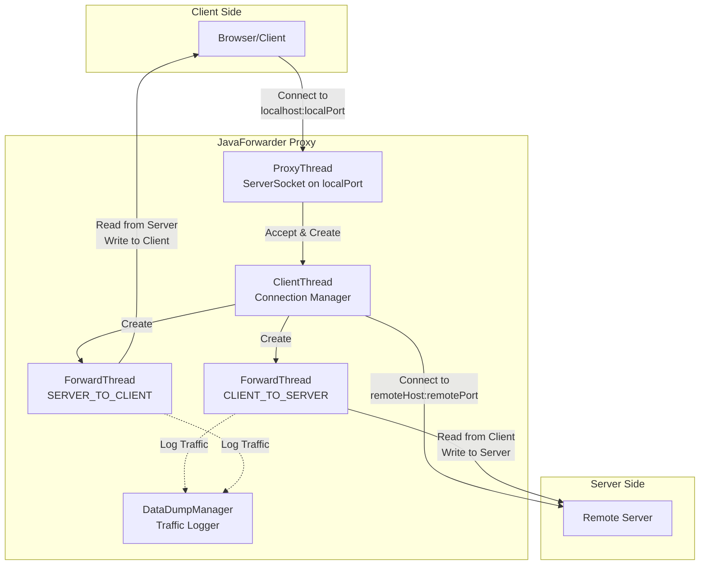
```mermaid
graph TB
    subgraph "Client Side"
        Browser[Browser/Client]
    end
    
    subgraph "JavaForwarder Proxy"
        PS[ProxyThread<br/>ServerSocket on localPort]
        CT[ClientThread<br/>Connection Manager]
        FT1[ForwardThread<br/>CLIENT_TO_SERVER]
        FT2[ForwardThread<br/>SERVER_TO_CLIENT]
        DDM[DataDumpManager<br/>Traffic Logger]
    end
    
    subgraph "Server Side"
        Server[Remote Server]
    end
    
    Browser -->|"Connect to<br/>localhost:localPort"| PS
    PS -->|"Accept & Create"| CT
    CT -->|"Create"| FT1
    CT -->|"Create"| FT2
    CT -->|"Connect to<br/>remoteHost:remotePort"| Server
    
    FT1 -->|"Read from Client<br/>Write to Server"| Server
    FT2 -->|"Read from Server<br/>Write to Client"| Browser
    
    FT1 -.->|"Log Traffic"| DDM
    FT2 -.->|"Log Traffic"| DDM
```

---

## Class Structure

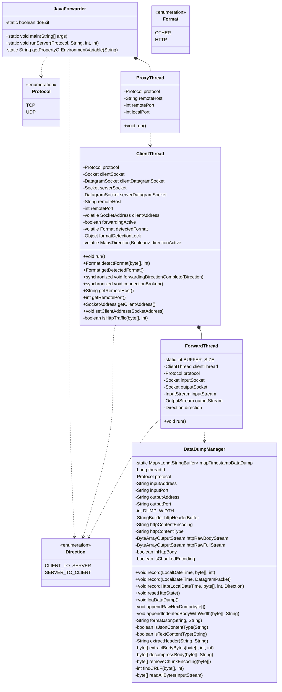
```mermaid
classDiagram
    class JavaForwarder {
        -static boolean doExit
        +static void main(String[] args)
        +static void runServer(Protocol, String, int, int)
        -static String getPropertyOrEnvironmentVariable(String)
    }
    
    class Protocol {
        <<enumeration>>
        TCP
        UDP
    }
    
    class Direction {
        <<enumeration>>
        CLIENT_TO_SERVER
        SERVER_TO_CLIENT
    }
    
    class Format {
        <<enumeration>>
        OTHER
        HTTP
    }
    
    class ClientThread {
        -Protocol protocol
        -Socket clientSocket
        -DatagramSocket clientDatagramSocket
        -Socket serverSocket
        -DatagramSocket serverDatagramSocket
        -String remoteHost
        -int remotePort
        -volatile SocketAddress clientAddress
        -boolean forwardingActive
        -volatile Format detectedFormat
        -Object formatDetectionLock
        -volatile Map~Direction,Boolean~ directionActive
        +void run()
        +Format detectFormat(byte[], int)
        +Format getDetectedFormat()
        +synchronized void forwardingDirectionComplete(Direction)
        +synchronized void connectionBroken()
        +String getRemoteHost()
        +int getRemotePort()
        +SocketAddress getClientAddress()
        +void setClientAddress(SocketAddress)
        -boolean isHttpTraffic(byte[], int)
    }
    
    class ForwardThread {
        -static int BUFFER_SIZE
        -ClientThread clientThread
        -Protocol protocol
        -Socket inputSocket
        -Socket outputSocket
        -InputStream inputStream
        -OutputStream outputStream
        -Direction direction
        +void run()
    }
    
    class DataDumpManager {
        -static Map~Long,StringBuffer~ mapTimestampDataDump
        -Long threadId
        -Protocol protocol
        -String inputAddress
        -String inputPort
        -String outputAddress
        -String outputPort
        -int DUMP_WIDTH
        -StringBuilder httpHeaderBuffer
        -String httpContentEncoding
        -String httpContentType
        -ByteArrayOutputStream httpRawBodyStream
        -ByteArrayOutputStream httpRawFullStream
        -boolean inHttpBody
        -boolean isChunkedEncoding
        +void record(LocalDateTime, byte[], int)
        +void record(LocalDateTime, DatagramPacket)
        +void recordHttp(LocalDateTime, byte[], int, Direction)
        +void resetHttpState()
        +void logDataDump()
        -void appendRawHexDump(byte[])
        -void appendIndentedBodyWithWidth(byte[], String)
        -String formatJson(String, String)
        -boolean isJsonContentType(String)
        -boolean isTextContentType(String)
        -String extractHeader(String, String)
        -byte[] extractBodyBytes(byte[], int, int)
        -byte[] decompressBody(byte[], String)
        -byte[] removeChunkEncoding(byte[])
        -int findCRLF(byte[], int)
        -byte[] readAllBytes(InputStream)
    }
    
    class ProxyThread {
        -Protocol protocol
        -String remoteHost
        -int remotePort
        -int localPort
        +void run()
    }
    
    JavaForwarder ..> Protocol
    JavaForwarder ..> Direction
    JavaForwarder *-- ProxyThread
    ProxyThread ..> ClientThread
    ClientThread *-- ForwardThread
    ForwardThread ..> DataDumpManager
    ClientThread ..> Direction
    ForwardThread ..> Direction
```

---

## Thread Model

JavaForwarder uses a multi-threaded architecture to handle bidirectional data forwarding:

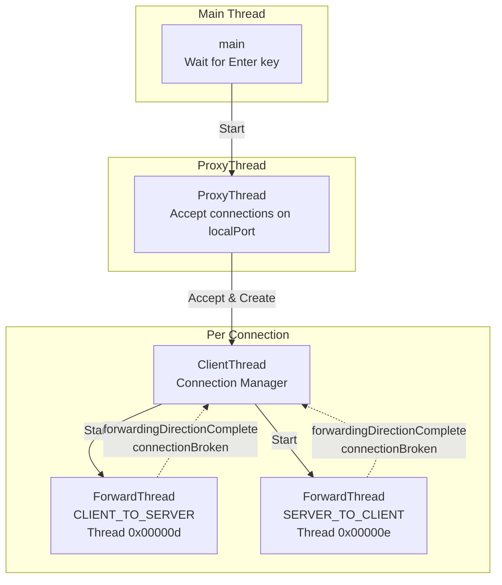
```mermaid
graph TD
    subgraph "Main Thread"
        M[main<br/>Wait for Enter key]
    end
    
    subgraph "ProxyThread"
        P[ProxyThread<br/>Accept connections on localPort]
    end
    
    subgraph "Per Connection"
        CT[ClientThread<br/>Connection Manager]
        FT1[ForwardThread<br/>CLIENT_TO_SERVER<br/>Thread 0x00000d]
        FT2[ForwardThread<br/>SERVER_TO_CLIENT<br/>Thread 0x00000e]
    end
    
    M -->|"Start"| P
    P -->|"Accept & Create"| CT
    CT -->|"Start"| FT1
    CT -->|"Start"| FT2
    
    FT1 -.->|"forwardingDirectionComplete<br/>connectionBroken"| CT
    FT2 -.->|"forwardingDirectionComplete<br/>connectionBroken"| CT
```

### Thread Responsibilities

| Thread | Responsibility |
|--------|---------------|
| **Main Thread** | Starts ProxyThread, waits for user input to terminate |
| **ProxyThread** | Listens on `localPort`, accepts connections, creates ClientThreads |
| **ClientThread** | Establishes server connection, manages ForwardThreads, handles cleanup |
| **ForwardThread (C→S)** | Reads from client, writes to server, logs traffic |
| **ForwardThread (S→C)** | Reads from server, writes to client, logs traffic |

---

## Connection Lifecycle

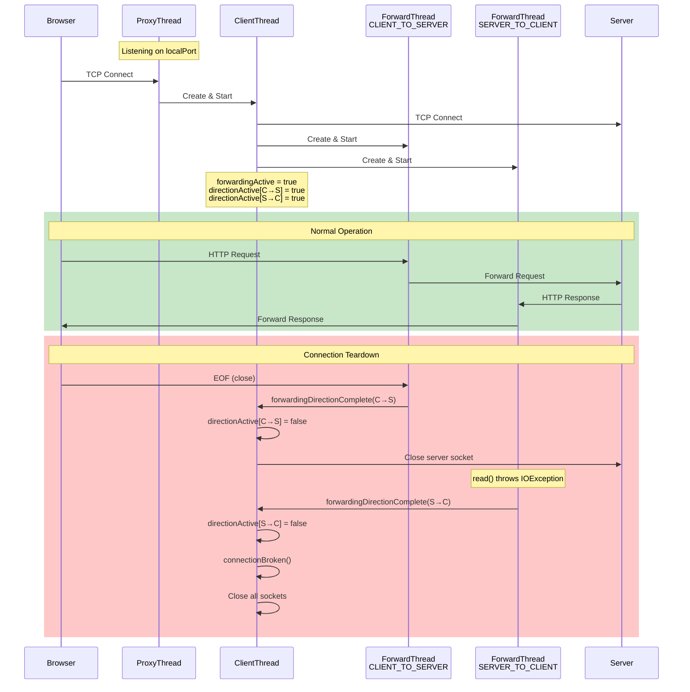
```mermaid
sequenceDiagram
    participant B as Browser
    participant P as ProxyThread
    participant CT as ClientThread
    participant FTC as ForwardThread<br/>CLIENT_TO_SERVER
    participant FTS as ForwardThread<br/>SERVER_TO_CLIENT
    participant S as Server

    Note over P: Listening on localPort
    
    B->>P: TCP Connect
    P->>CT: Create & Start
    CT->>S: TCP Connect
    CT->>FTC: Create & Start
    CT->>FTS: Create & Start
    
    Note over CT: forwardingActive = true<br/>directionActive[C→S] = true<br/>directionActive[S→C] = true
    
    rect rgb(200, 230, 200)
        Note over B,S: Normal Operation
        B->>FTC: HTTP Request
        FTC->>S: Forward Request
        S->>FTS: HTTP Response
        FTS->>B: Forward Response
    end
    
    rect rgb(255, 200, 200)
        Note over B,S: Connection Teardown
        B->>FTC: EOF (close)
        FTC->>CT: forwardingDirectionComplete(C→S)
        CT->>CT: directionActive[C→S] = false
        CT->>S: Close server socket
        Note over FTS: read() throws IOException
        FTS->>CT: forwardingDirectionComplete(S→C)
        CT->>CT: directionActive[S→C] = false
        CT->>CT: connectionBroken()
        CT->>CT: Close all sockets
    end
```

---

## Half-Close Socket Handling

TCP supports "half-close" where one direction of the connection can be closed while the other remains open. This is crucial for HTTP Keep-Alive where:

1. The client sends a request, then waits
2. The server sends a response, may close its side
3. The client may send another request

### The Challenge

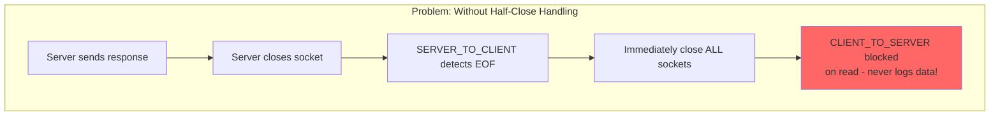
```mermaid
graph TB
    subgraph "Problem: Without Half-Close Handling"
        A1[Server sends response] --> A2[Server closes socket]
        A2 --> A3[SERVER_TO_CLIENT detects EOF]
        A3 --> A4[Immediately close ALL sockets]
        A4 --> A5[CLIENT_TO_SERVER blocked<br/>on read - never logs data!]
        style A5 fill:#ff6666
    end
```

### The Solution

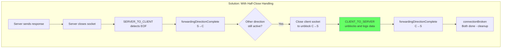
```mermaid
graph TB
    subgraph "Solution: With Half-Close Handling"
        B1[Server sends response] --> B2[Server closes socket]
        B2 --> B3[SERVER_TO_CLIENT detects EOF]
        B3 --> B4[forwardingDirectionComplete<br/>S→C]
        B4 --> B5{Other direction<br/>still active?}
        B5 -->|Yes| B6[Close client socket<br/>to unblock C→S]
        B6 --> B7[CLIENT_TO_SERVER<br/>unblocks and logs data]
        B7 --> B8[forwardingDirectionComplete<br/>C→S]
        B8 --> B9[connectionBroken<br/>Both done - cleanup]
        style B7 fill:#66ff66
    end
```

### Direction State Machine

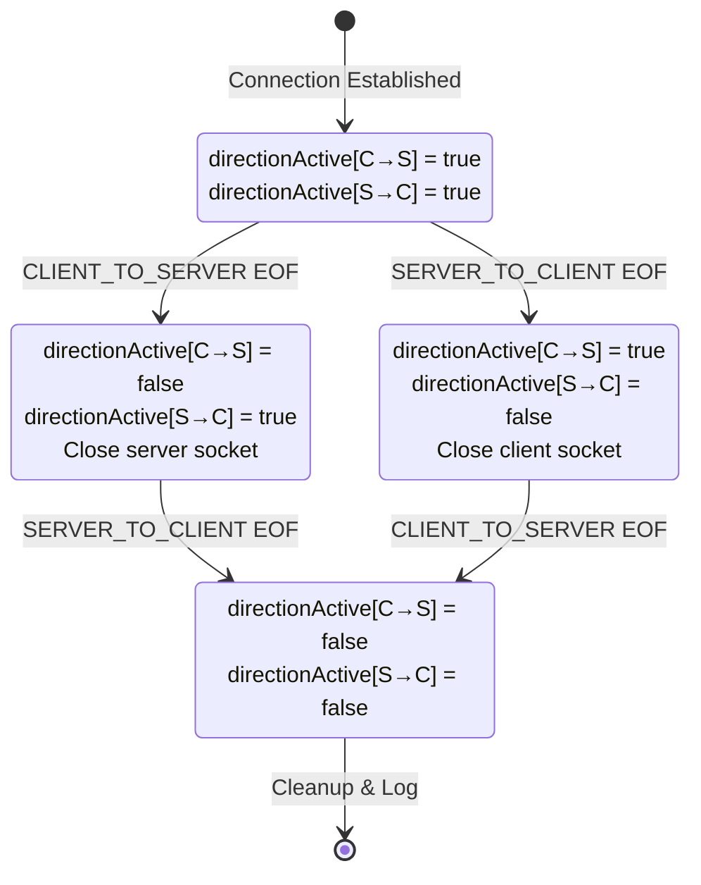
```mermaid
stateDiagram-v2
    [*] --> BothActive: Connection Established
    
    BothActive: directionActive[C→S] = true<br/>directionActive[S→C] = true
    
    BothActive --> ClientClosed: CLIENT_TO_SERVER EOF
    BothActive --> ServerClosed: SERVER_TO_CLIENT EOF
    
    ClientClosed: directionActive[C→S] = false<br/>directionActive[S→C] = true<br/>Close server socket
    
    ServerClosed: directionActive[C→S] = true<br/>directionActive[S→C] = false<br/>Close client socket
    
    ClientClosed --> BothClosed: SERVER_TO_CLIENT EOF
    ServerClosed --> BothClosed: CLIENT_TO_SERVER EOF
    
    BothClosed: directionActive[C→S] = false<br/>directionActive[S→C] = false
    
    BothClosed --> [*]: Cleanup & Log
```

### forwardingDirectionComplete() Logic

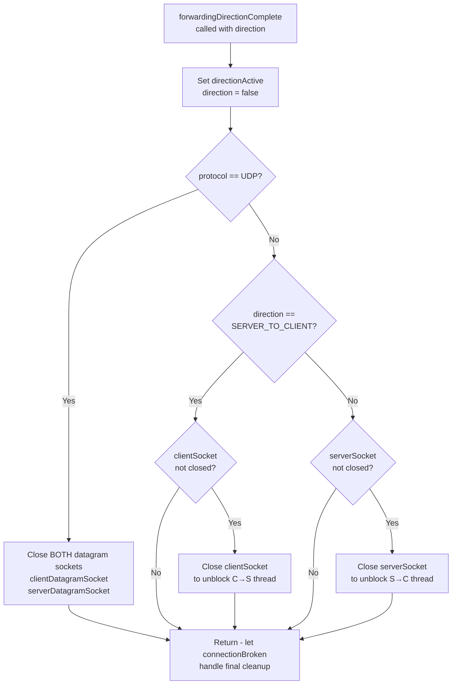
```mermaid
flowchart TD
    A[forwardingDirectionComplete<br/>called with direction] --> B[Set directionActive<br/>direction = false]
    
    B --> P{protocol == UDP?}
    P -->|Yes| Q[Close BOTH datagram sockets<br/>clientDatagramSocket<br/>serverDatagramSocket]
    Q --> G
    
    P -->|No| C{direction ==<br/>SERVER_TO_CLIENT?}
    
    C -->|Yes| D{clientSocket<br/>not closed?}
    D -->|Yes| E[Close clientSocket<br/>to unblock C→S thread]
    D -->|No| G
    E --> G
    
    C -->|No| F{serverSocket<br/>not closed?}
    F -->|Yes| H[Close serverSocket<br/>to unblock S→C thread]
    F -->|No| G
    H --> G
    
    G[Return - let connectionBroken<br/>handle final cleanup]
```

**Note for UDP:** Unlike TCP which supports half-close semantics, UDP has no notion of a graceful directional shutdown. When either UDP forwarding direction terminates, both datagram sockets are closed immediately to unblock the other thread blocked on `receive()`.

### connectionBroken() Logic

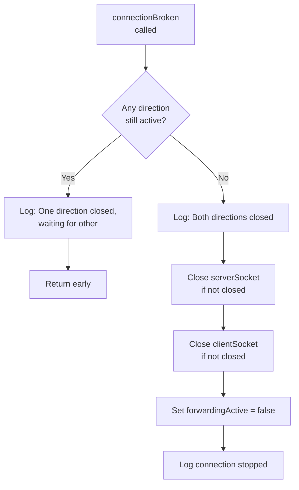
```mermaid
flowchart TD
    A[connectionBroken<br/>called] --> B{Any direction<br/>still active?}
    
    B -->|Yes| C[Log: One direction closed,<br/>waiting for other]
    C --> D[Return early]
    
    B -->|No| E[Log: Both directions closed]
    E --> F[Close serverSocket<br/>if not closed]
    F --> G[Close clientSocket<br/>if not closed]
    G --> H[Set forwardingActive = false]
    H --> I[Log connection stopped]
```

---

## Data Flow and Chunking

### Buffer-Based Data Forwarding

Each ForwardThread reads data in chunks of up to `BUFFER_SIZE` (65536 bytes):

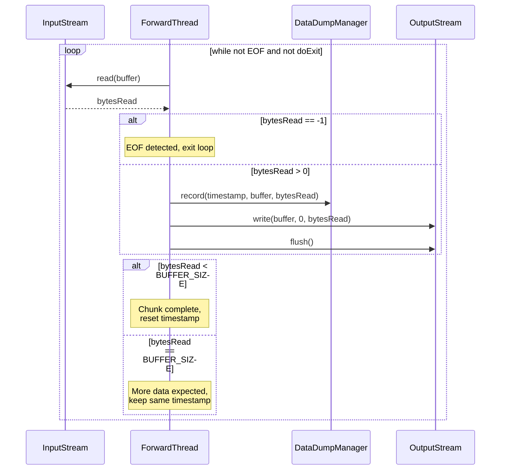
```mermaid
sequenceDiagram
    participant IS as InputStream
    participant FT as ForwardThread
    participant DDM as DataDumpManager
    participant OS as OutputStream

    loop while not EOF and not doExit
        FT->>IS: read(buffer)
        IS-->>FT: bytesRead
        
        alt bytesRead == -1
            Note over FT: EOF detected, exit loop
        else bytesRead > 0
            FT->>DDM: record(timestamp, buffer, bytesRead)
            FT->>OS: write(buffer, 0, bytesRead)
            FT->>OS: flush()
        end
        
        alt bytesRead < BUFFER_SIZE
            Note over FT: Chunk complete,<br/>reset timestamp
        else bytesRead == BUFFER_SIZE
            Note over FT: More data expected,<br/>keep same timestamp
        end
    end
```

### Timestamp Logic for Chunking

The timestamp logic groups consecutive buffer reads under the same timestamp when they likely belong to the same logical data unit:

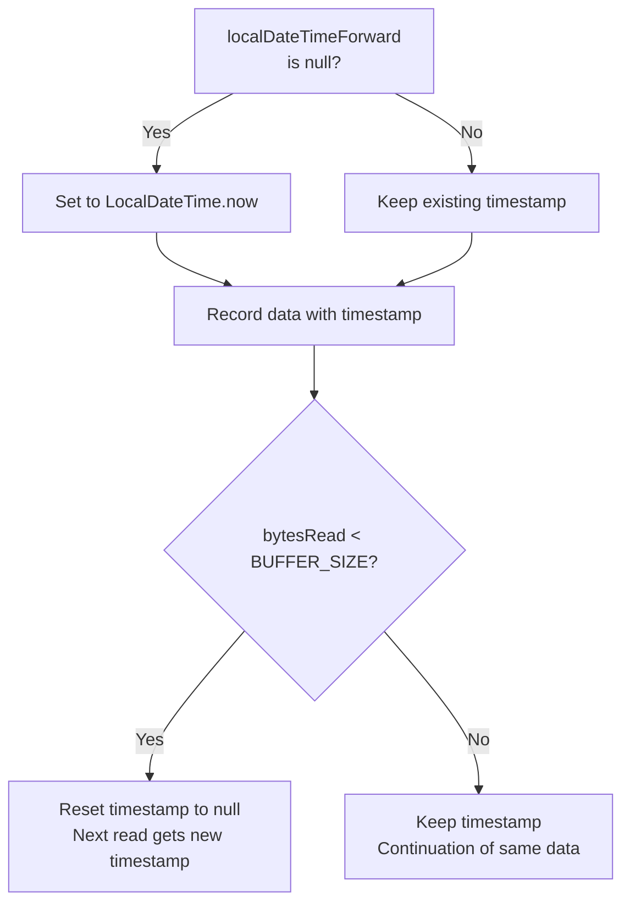
```mermaid
graph TD
    A[localDateTimeForward<br/>is null?] -->|Yes| B[Set to LocalDateTime.now]
    A -->|No| C[Keep existing timestamp]
    B --> D[Record data with timestamp]
    C --> D
    D --> E{bytesRead < BUFFER_SIZE?}
    E -->|Yes| F[Reset timestamp to null<br/>Next read gets new timestamp]
    E -->|No| G[Keep timestamp<br/>Continuation of same data]
```

**Example:**
- Large HTTP response (100KB):
  - Read 1: 65536 bytes @ timestamp T1 → keep timestamp
  - Read 2: 36864 bytes @ timestamp T1 → reset timestamp
- Small HTTP request (500 bytes):
  - Read: 500 bytes @ timestamp T2 → reset timestamp

---

## HTTP Format Detection

When `DUMP_HTTP` is enabled, JavaForwarder automatically detects HTTP traffic and provides enhanced logging. The detection is performed on the first data chunk received and shared between both forwarding threads.

### Format Enum

The `Format` enumeration defines the detected traffic types:

| Value | Description |
|-------|-------------|
| `OTHER` | Non-HTTP TCP traffic (raw hex dump only) |
| `HTTP` | HTTP/1.x traffic detected (enhanced parsing available) |

### Detection Logic

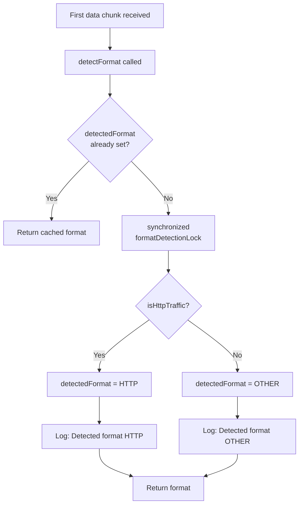
```mermaid
flowchart TD
    A[First data chunk received] --> B[detectFormat called]
    B --> C{detectedFormat<br/>already set?}
    C -->|Yes| D[Return cached format]
    C -->|No| E[synchronized<br/>formatDetectionLock]
    E --> F{isHttpTraffic?}
    F -->|Yes| G[detectedFormat = HTTP]
    F -->|No| H[detectedFormat = OTHER]
    G --> I[Log: Detected format HTTP]
    H --> J[Log: Detected format OTHER]
    I --> K[Return format]
    J --> K
```

### HTTP Detection Rules

The `isHttpTraffic()` method checks the first 16 bytes of data for HTTP signatures:

**Request Methods:**
- `GET `, `POST `, `PUT `, `DELETE `, `PATCH `
- `HEAD `, `OPTIONS `, `CONNECT `, `TRACE `

**Response Status Line:**
- `HTTP/1.0`, `HTTP/1.1`

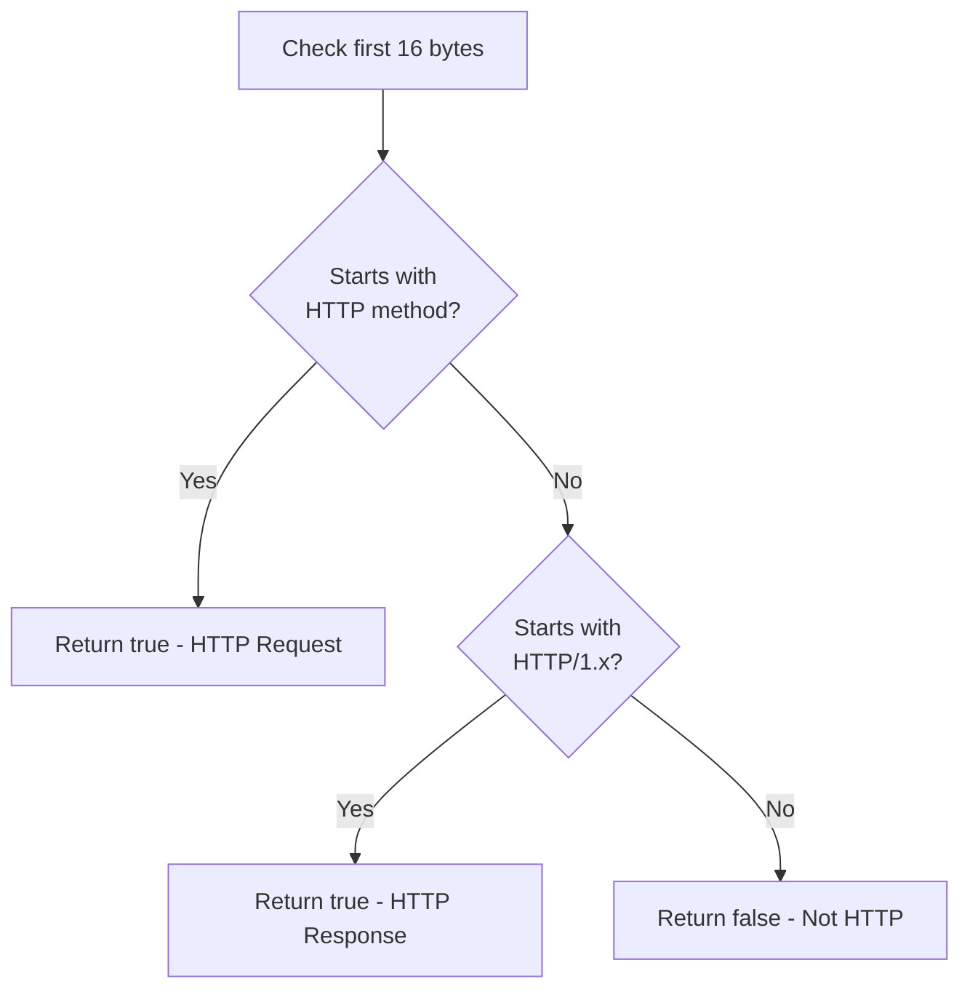
```mermaid
graph TD
    A[Check first 16 bytes] --> B{Starts with<br/>HTTP method?}
    B -->|Yes| C[Return true - HTTP Request]
    B -->|No| D{Starts with<br/>HTTP/1.x?}
    D -->|Yes| E[Return true - HTTP Response]
    D -->|No| F[Return false - Not HTTP]
```

### Thread-Safe Detection

Both `CLIENT_TO_SERVER` and `SERVER_TO_CLIENT` threads share the same `detectedFormat` field. Thread safety is ensured via:

1. **`volatile` modifier** on `detectedFormat` - ensures visibility across threads
2. **`formatDetectionLock`** - synchronized block ensures only first caller performs detection

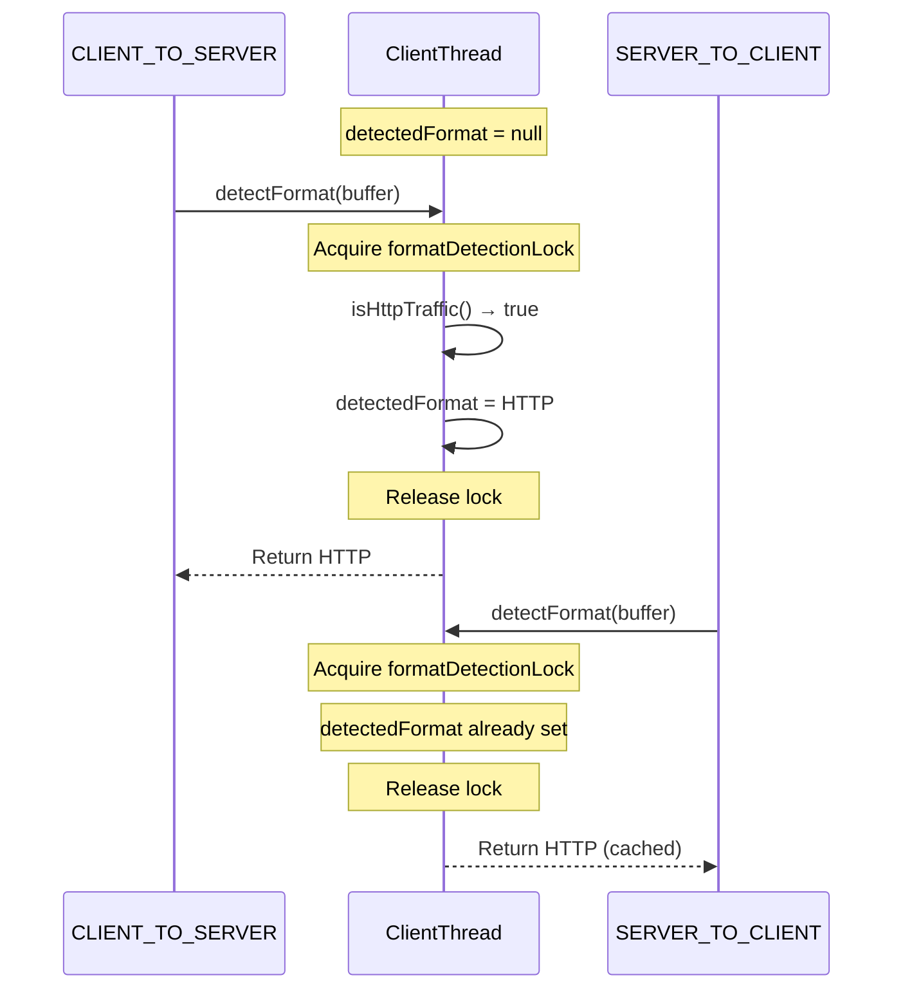
```mermaid
sequenceDiagram
    participant C2S as CLIENT_TO_SERVER
    participant CT as ClientThread
    participant S2C as SERVER_TO_CLIENT

    Note over CT: detectedFormat = null

    C2S->>CT: detectFormat(buffer)
    Note over CT: Acquire formatDetectionLock
    CT->>CT: isHttpTraffic() → true
    CT->>CT: detectedFormat = HTTP
    Note over CT: Release lock
    CT-->>C2S: Return HTTP

    S2C->>CT: detectFormat(buffer)
    Note over CT: Acquire formatDetectionLock
    Note over CT: detectedFormat already set
    Note over CT: Release lock
    CT-->>S2C: Return HTTP (cached)
```

---

## Data Dump Management

### Static Shared Map

The `DataDumpManager` uses a static map shared across all ForwardThreads to ensure chronological ordering:

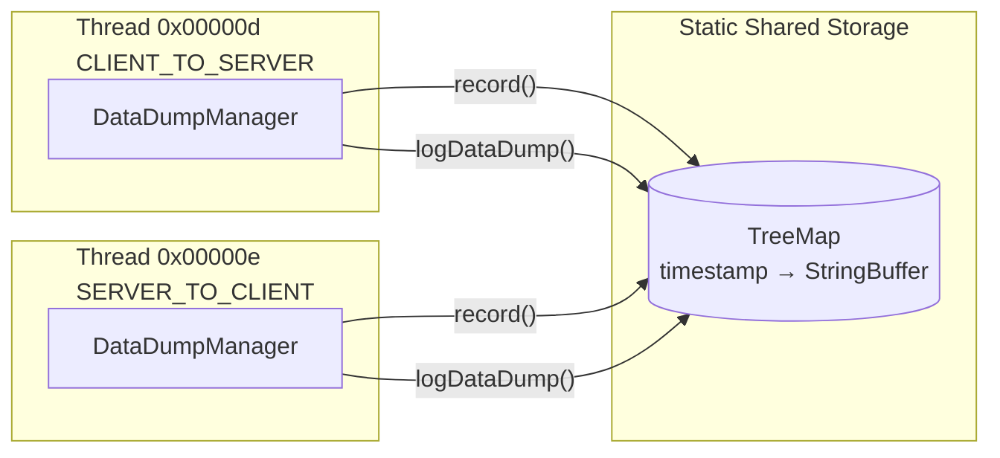
```mermaid
graph LR
    subgraph "Thread 0x00000d<br/>CLIENT_TO_SERVER"
        DDM1[DataDumpManager]
    end
    
    subgraph "Thread 0x00000e<br/>SERVER_TO_CLIENT"
        DDM2[DataDumpManager]
    end
    
    subgraph "Static Shared Storage"
        MAP[(TreeMap<br/>timestamp → StringBuffer)]
    end
    
    DDM1 -->|"record()"| MAP
    DDM2 -->|"record()"| MAP
    DDM1 -->|"logDataDump()"| MAP
    DDM2 -->|"logDataDump()"| MAP
```

### Synchronized Access

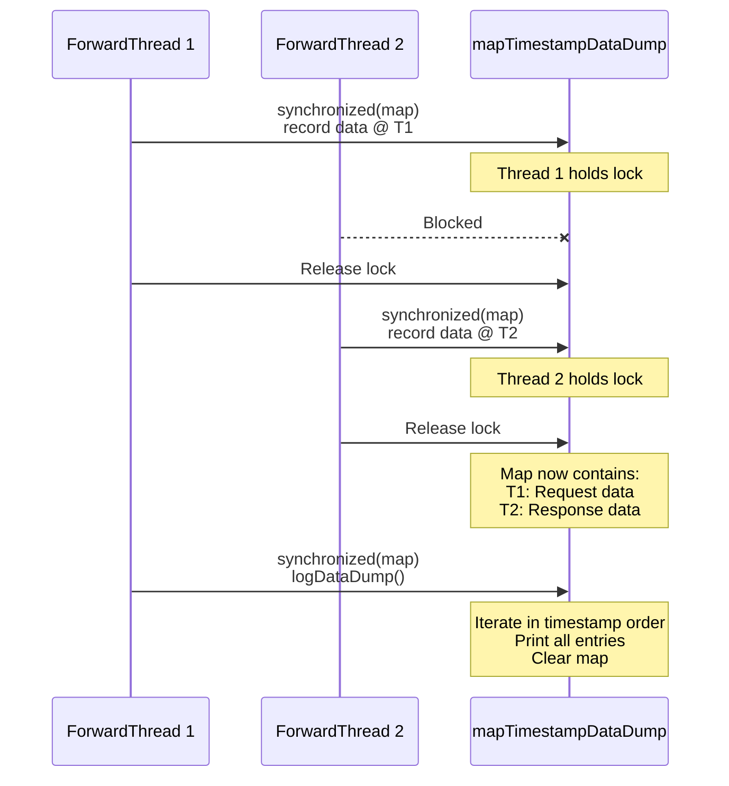
```mermaid
sequenceDiagram
    participant FT1 as ForwardThread 1
    participant FT2 as ForwardThread 2
    participant MAP as mapTimestampDataDump

    FT1->>MAP: synchronized(map)<br/>record data @ T1
    Note over MAP: Thread 1 holds lock
    FT2--xMAP: Blocked
    FT1->>MAP: Release lock
    
    FT2->>MAP: synchronized(map)<br/>record data @ T2
    Note over MAP: Thread 2 holds lock
    FT2->>MAP: Release lock
    
    Note over MAP: Map now contains:<br/>T1: Request data<br/>T2: Response data
    
    FT1->>MAP: synchronized(map)<br/>logDataDump()
    Note over MAP: Iterate in timestamp order<br/>Print all entries<br/>Clear map
```

### Output Format

```
Thread 00000d: 2026-06-03 18:20:30.409: 127.0.0.1:54247 -> 127.0.0.1:3000
  Offset 00 01 02 03 04 05 06 07 08 09 0A 0B 0C 0D 0E 0F 0123456789ABCDEF
  -----------------------------------------------------------------------
  000000 47 45 54 20 2F 20 48 54 54 50 2F 31 2E 31 0D 0A GET / HTTP/1.1  
```

---

## HTTP Dump Management (DUMP_HTTP)

When `DUMP_HTTP` is enabled and HTTP traffic is detected, JavaForwarder provides enhanced HTTP-aware logging that displays both raw hex dump and parsed HTTP content.

### DUMP_HTTP vs DUMP

| Feature | DUMP | DUMP_HTTP |
|---------|------|-----------|
| Raw hex dump | ✅ | ✅ |
| Parsed HTTP headers | ❌ | ✅ (indented) |
| Decoded body | ❌ | ✅ (decompressed, de-chunked) |
| Chunked encoding handling | Raw display | Clean body without chunk markers |
| Compression handling | Raw compressed bytes | Decompressed content |
| Format detection | None | Automatic HTTP detection |
| Content-Type aware rendering | ❌ | ✅ (JSON pretty-print, text, binary hex) |

### Output Format

DUMP_HTTP produces a structured output with both raw and parsed sections:

```
Thread 00000d: 2026-06-04 18:52:38.730: 127.0.0.1:54011 -> 127.0.0.1:3000 [HTTP REQUEST]
  Offset 00 01 02 03 04 05 06 07 08 09 0A 0B 0C 0D 0E 0F 0123456789ABCDEF
  -----------------------------------------------------------------------
  000000 47 45 54 20 2F 66 61 76 69 63 6F 6E 2E 69 63 6F GET /favicon.ico
  000010 20 48 54 54 50 2F 31 2E 31 0D 0A 48 6F 73 74 3A  HTTP/1.1  Host:
  ...
  -----------------------------------------------------------------------
  GET /favicon.ico HTTP/1.1
  Host: localhost
  User-Agent: Mozilla/5.0 (Windows NT 10.0; Win64; x64)
  Accept: image/avif,image/webp,image/png
  Accept-Encoding: gzip, deflate, br, zstd
  Connection: keep-alive
  -----------------------------------------------------------------------
  (decoded body content here)
```

### Data Flow in DUMP_HTTP Mode

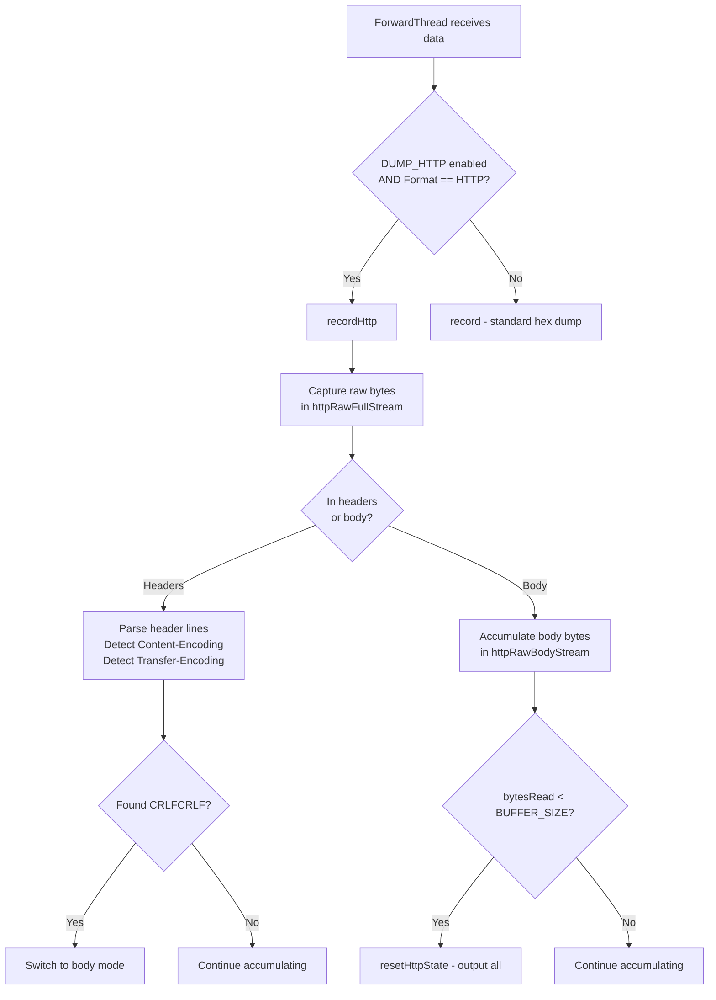
```mermaid
flowchart TD
    A[ForwardThread receives data] --> B{DUMP_HTTP enabled<br/>AND Format == HTTP?}
    B -->|Yes| C[recordHttp]
    B -->|No| D[record - standard hex dump]
    
    C --> E[Capture raw bytes<br/>in httpRawFullStream]
    E --> F{In headers<br/>or body?}
    F -->|Headers| G[Parse header lines<br/>Detect Content-Encoding<br/>Detect Transfer-Encoding]
    F -->|Body| H[Accumulate body bytes<br/>in httpRawBodyStream]
    G --> I{Found CRLFCRLF?}
    I -->|Yes| J[Switch to body mode]
    I -->|No| K[Continue accumulating]
    
    H --> L{bytesRead < BUFFER_SIZE?}
    L -->|Yes| M[resetHttpState - output all]
    L -->|No| N[Continue accumulating]
```

### resetHttpState() Processing

When message is complete, `resetHttpState()` outputs everything:

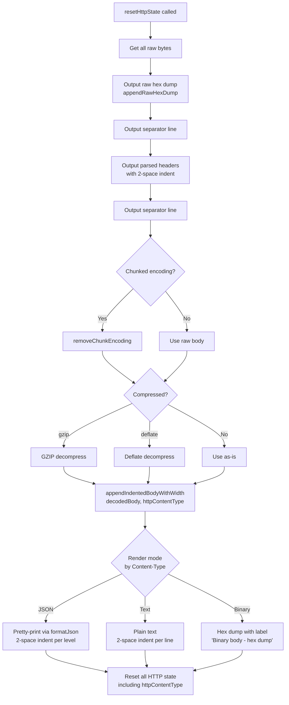
```mermaid
flowchart TD
    A[resetHttpState called] --> B[Get all raw bytes]
    B --> C[Output raw hex dump<br/>appendRawHexDump]
    C --> D[Output separator line]
    D --> E[Output parsed headers<br/>with 2-space indent]
    E --> F[Output separator line]
    F --> G{Chunked encoding?}
    G -->|Yes| H[removeChunkEncoding]
    G -->|No| I[Use raw body]
    H --> J{Compressed?}
    I --> J
    J -->|gzip| K[GZIP decompress]
    J -->|deflate| L[Deflate decompress]
    J -->|No| M[Use as-is]
    K --> N[appendIndentedBodyWithWidth<br/>decodedBody, httpContentType]
    L --> N
    M --> N
    N --> N1{Render mode<br/>by Content-Type}
    N1 -->|JSON| N2[Pretty-print via formatJson<br/>2-space indent per level]
    N1 -->|Text| N3[Plain text<br/>2-space indent per line]
    N1 -->|Binary| N4[Hex dump with label<br/>'Binary body - hex dump']
    N2 --> O
    N3 --> O
    N4 --> O
    O[Reset all HTTP state<br/>including httpContentType]
```

### Chunked Transfer Encoding

HTTP chunked encoding wraps body content with chunk size metadata. DUMP_HTTP removes this for clean display:

**Wire Format (raw):**
```
d\r\n              ← chunk size in hex (13 bytes)
Hello World!\n    ← actual data (13 bytes)
\r\n              ← chunk end
0\r\n             ← last chunk (size 0)
\r\n              ← final CRLF
```

**DUMP_HTTP Output (decoded):**
```
Hello World!
```

### Compression Handling

DUMP_HTTP automatically decompresses bodies based on `Content-Encoding` header:

| Content-Encoding | Decompression Method |
|-----------------|---------------------|
| `gzip` | `GZIPInputStream` |
| `deflate` | `InflaterInputStream` |
| (none/other) | No decompression |

If decompression fails (corrupt data), the raw bytes are displayed with an error message.

### HTTP State Fields

| Field | Purpose |
|-------|---------|
| `httpHeaderBuffer` | Accumulates header lines until CRLFCRLF found |
| `httpRawBodyStream` | Accumulates raw body bytes (for decompression) |
| `httpRawFullStream` | Accumulates ALL raw bytes (for hex dump) |
| `httpContentEncoding` | Extracted from headers for decompression |
| `httpContentType` | Extracted from Content-Type header for body render-mode selection (JSON / text / binary) |
| `isChunkedEncoding` | Extracted from Transfer-Encoding header |
| `inHttpBody` | State flag: parsing headers vs body |

### Body Rendering Modes

After the body has been de-chunked and decompressed, `appendIndentedBodyWithWidth(byte[] bodyBytes, String contentType)` selects one of three render modes based on the `Content-Type` header (with a UTF-8 decode fallback when no recognized MIME type is present):

| Render Mode | Detection | Output Style |
|-------------|-----------|--------------|
| **JSON** | `isJsonContentType(contentType)` matches `application/json`, `application/ld+json`, `application/graphql`, or any `+json` suffix | Pretty-printed via `formatJson()` — newlines after `{`, `[`, `,`; 2-space indent per nesting depth; empty `{}`/`[]` kept inline. Each output line is prefixed with 2 spaces for alignment with headers |
| **Text** | `isTextContentType(contentType)` matches `text/*`, `application/xml`, `application/xhtml`, `application/x-www-form-urlencoded`, `application/javascript`, `+json` or `+xml` suffixes — OR a UTF-8 decode of the body succeeds without errors | Decoded as UTF-8, each line prefixed with 2 spaces, original line breaks preserved |
| **Binary** | All other cases (binary content type, non-decodable bytes) | Header line `[Binary body - hex dump]` followed by an indented hex dump (offset + DUMP_WIDTH bytes hex + ASCII column, dots for non-printable) |

### JSON Pretty-Printing

The `formatJson(String json, String indent)` helper is a self-contained pretty-printer (no external libraries) that:

- Tracks string state (with backslash escape handling) so structural characters inside strings are not reformatted
- Inserts a newline + indentation after `{`, `[`, and `,`
- Inserts a newline + indentation before `}` and `]`
- Renders `:` as `": "` for compact key/value pairs
- Detects empty `{}` / `[]` via lookahead and keeps them on a single line
- Falls back gracefully on malformed input (no exceptions thrown)

### Content-Type Helper Methods

| Method | Purpose |
|--------|---------|
| `isJsonContentType(String)` | Returns true for JSON-bearing MIME types: `application/json`, `application/ld+json`, `application/graphql`, and any `+json` suffix |
| `isTextContentType(String)` | Returns true for any displayable text MIME type, including `text/*`, XML/JSON variants, form-urlencoded, JavaScript, and `+json` / `+xml` suffixes |

---

## Configuration

### Environment Variables

| Variable | Description | Default |
|----------|-------------|---------|
| `MODE` | Protocol: `TCP` or `UDP` | `TCP` |
| `DUMP` | Enable raw hex traffic logging (any value) | disabled |
| `DUMP_WIDTH` | Bytes per row in hex dump (multiple of 16) | 16 |
| `DUMP_HTTP` | HTTP-aware logging with parsed headers, decompression, and de-chunking | disabled |

### Command Line

```bash
java JavaForwarder <remoteHost> <remotePort> <localPort>
```

**Example:**
```bash
# Forward traffic from localhost:80 to localhost:3000
# Set DUMP environment variable to enable logging
export DUMP=1
java JavaForwarder localhost 3000 80
```

---

## HTTP Keep-Alive Scenario

The following diagram shows a complete HTTP Keep-Alive scenario with two requests:

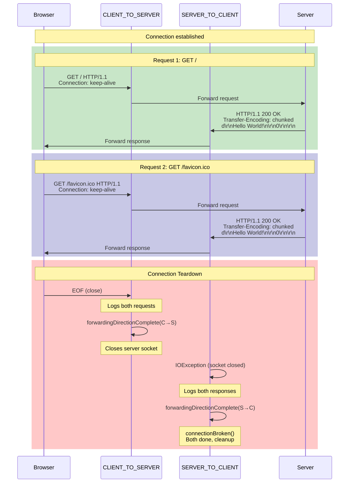
```mermaid
sequenceDiagram
    participant B as Browser
    participant C2S as CLIENT_TO_SERVER
    participant S2C as SERVER_TO_CLIENT
    participant S as Server

    Note over B,S: Connection established

    rect rgb(200, 230, 200)
        Note over B,S: Request 1: GET /
        B->>C2S: GET / HTTP/1.1<br/>Connection: keep-alive
        C2S->>S: Forward request
        S->>S2C: HTTP/1.1 200 OK<br/>Transfer-Encoding: chunked<br/>d\r\nHello World!\n\r\n0\r\n\r\n
        S2C->>B: Forward response
    end

    rect rgb(200, 200, 230)
        Note over B,S: Request 2: GET /favicon.ico
        B->>C2S: GET /favicon.ico HTTP/1.1<br/>Connection: keep-alive
        C2S->>S: Forward request
        S->>S2C: HTTP/1.1 200 OK<br/>Transfer-Encoding: chunked<br/>d\r\nHello World!\n\r\n0\r\n\r\n
        S2C->>B: Forward response
    end

    rect rgb(255, 200, 200)
        Note over B,S: Connection Teardown
        B->>C2S: EOF (close)
        Note over C2S: Logs both requests
        C2S->>C2S: forwardingDirectionComplete(C→S)
        Note over C2S: Closes server socket
        S2C->>S2C: IOException (socket closed)
        Note over S2C: Logs both responses
        S2C->>S2C: forwardingDirectionComplete(S→C)
        Note over S2C: connectionBroken()<br/>Both done, cleanup
    end
```

---

## Typical Log Output

```
JavaForwarder v1.23 (C) by Roman.Stangl@gmx.net
JavaForwarder starting proxy thread, forwarding TCP connection: localhost:3000 on local port 80
JavaForwarder proxy thread waiting for client connection(s) ...
JavaForwarder waiting for client connection(s), press Enter to terminate JavaForwarder ...
JavaForwarder accepted client thread ...
JavaForwarder connecting to server ...
JavaForwarder connected to server
JavaForwarder TCP connection: 127.0.0.1:54247 <--> 127.0.0.1:3000 started

Thread 00000d: 2026-06-03 18:20:30.409: 127.0.0.1:54247 -> 127.0.0.1:3000
  [Request 1: GET / HTTP/1.1 ...]

Thread 00000e: 2026-06-03 18:20:30.443: 127.0.0.1:3000 -> 127.0.0.1:54247
  [Response 1: HTTP/1.1 200 OK ...]

Thread 00000d: 2026-06-03 18:20:30.489: 127.0.0.1:54247 -> 127.0.0.1:3000
  [Request 2: GET /favicon.ico HTTP/1.1 ...]

Thread 00000e: 2026-06-03 18:20:30.493: 127.0.0.1:3000 -> 127.0.0.1:54247
  [Response 2: HTTP/1.1 200 OK ...]

JavaForwarder: CLIENT_TO_SERVER forwarding completed
JavaForwarder: Closed server socket to unblock SERVER_TO_CLIENT
JavaForwarder: SERVER_TO_CLIENT forwarding completed
JavaForwarder: Both directions closed, terminating connection
JavaForwarder TCP connection: 127.0.0.1:54247 <--> 127.0.0.1:3000 stopped
```

---

## Possible Future Enhancements

1. **UDP Support**
   - Currently partially implemented
   - Needs bidirectional forwarding completion

2. **Connection Pooling**
   - Reuse server connections for multiple client connections
   - Reduce connection overhead

3. **TLS/SSL Support**
   - Intercept HTTPS traffic (with proper certificates)
   - Display decrypted content

4. **HTTP/2 Support**
   - Binary protocol detection and parsing
   - Frame-level logging

---

## License

This program is freeware based on an example from the book "Internet programming with Java" by Svetlin Nakov.

For more information: http://www.nakov.com/books/inetjava/
