# JavaForwarder Architecture Document

## Overview

JavaForwarder is a TCP reverse proxy that transparently forwards traffic between a client and a server while logging the data exchanged. It supports HTTP Keep-Alive connections and properly handles half-closed TCP sockets.

## Table of Contents

1. [High-Level Architecture](#high-level-architecture)
2. [Class Structure](#class-structure)
3. [Thread Model](#thread-model)
4. [Connection Lifecycle](#connection-lifecycle)
5. [Half-Close Socket Handling](#half-close-socket-handling)
6. [Data Flow and Chunking](#data-flow-and-chunking)
7. [Data Dump Management](#data-dump-management)
8. [Configuration](#configuration)

---

## High-Level Architecture

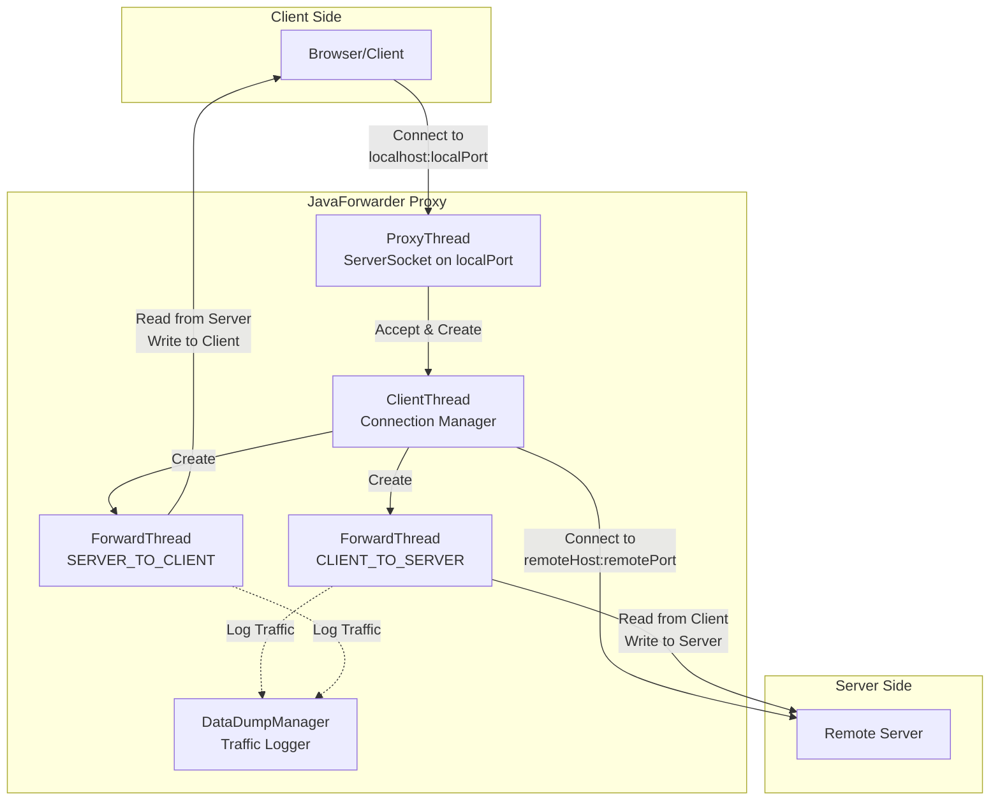

---

## Class Structure

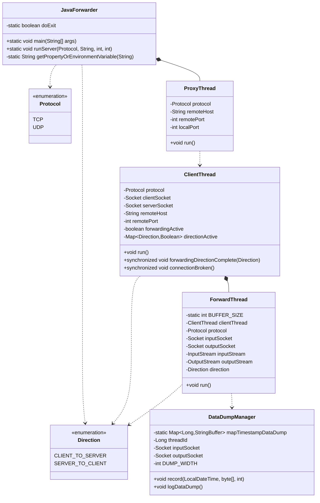

---

## Thread Model

JavaForwarder uses a multi-threaded architecture to handle bidirectional data forwarding:

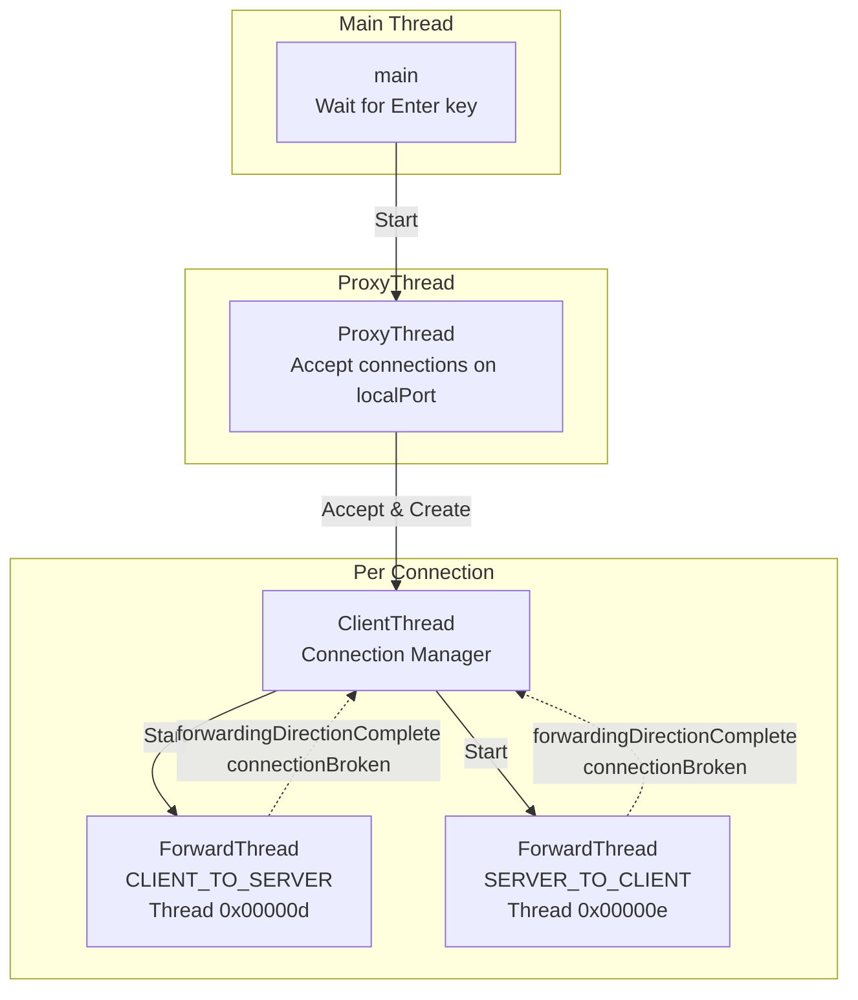

### Thread Responsibilities

| Thread | Responsibility |
|--------|---------------|
| **Main Thread** | Starts ProxyThread, waits for user input to terminate |
| **ProxyThread** | Listens on `localPort`, accepts connections, creates ClientThreads |
| **ClientThread** | Establishes server connection, manages ForwardThreads, handles cleanup |
| **ForwardThread (C→S)** | Reads from client, writes to server, logs traffic |
| **ForwardThread (S→C)** | Reads from server, writes to client, logs traffic |

---

## Connection Lifecycle

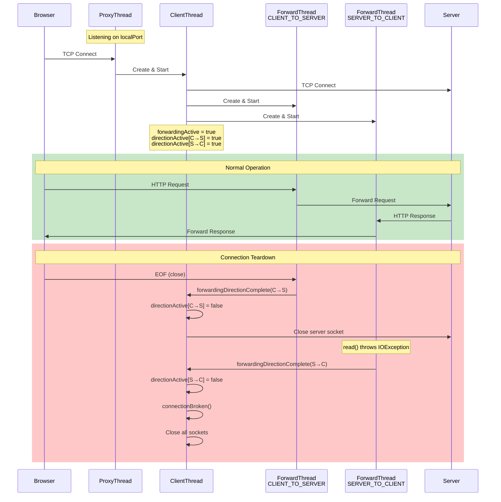

---

## Half-Close Socket Handling

TCP supports "half-close" where one direction of the connection can be closed while the other remains open. This is crucial for HTTP Keep-Alive where:

1. The client sends a request, then waits
2. The server sends a response, may close its side
3. The client may send another request

### The Challenge

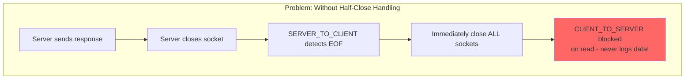

### The Solution

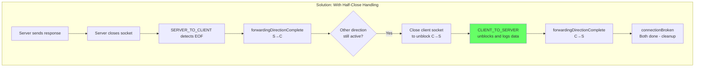

### Direction State Machine

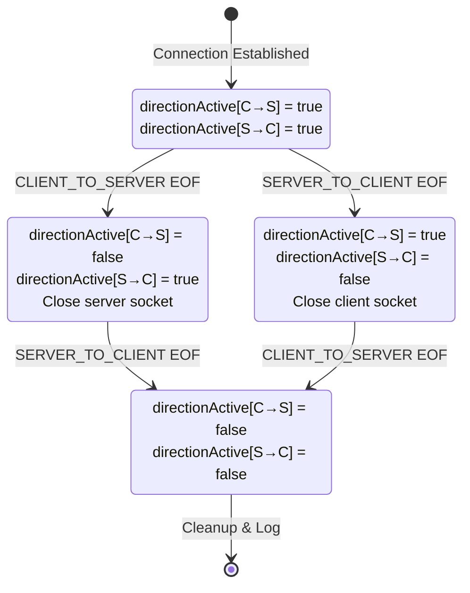

### forwardingDirectionComplete() Logic

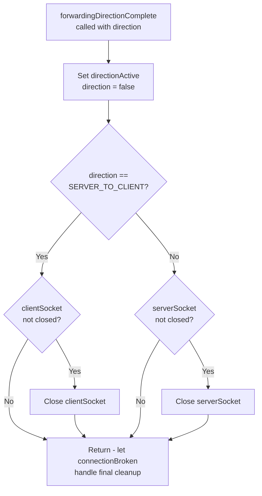

### connectionBroken() Logic

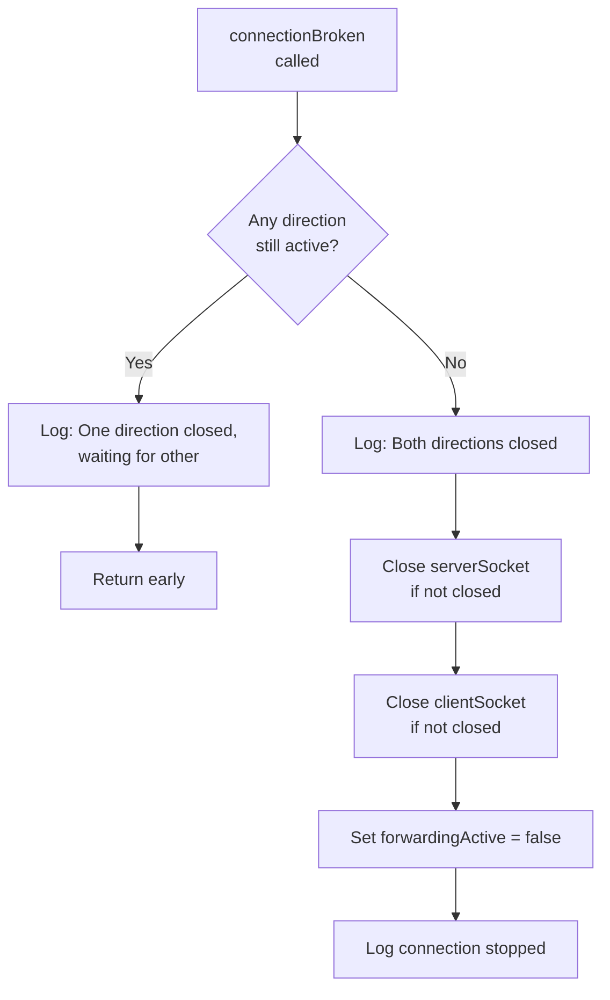

---

## Data Flow and Chunking

### Buffer-Based Data Forwarding

Each ForwardThread reads data in chunks of up to `BUFFER_SIZE` (8192 bytes):

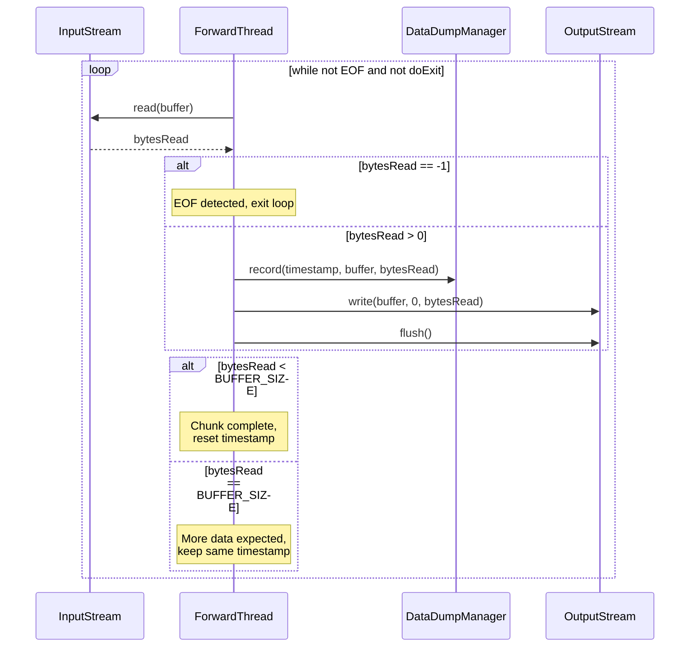

### Timestamp Logic for Chunking

The timestamp logic groups consecutive buffer reads under the same timestamp when they likely belong to the same logical data unit:

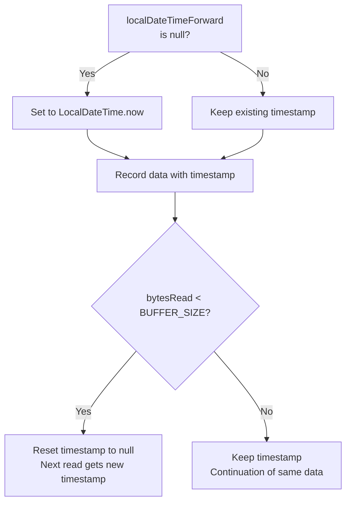

**Example:**
- Large HTTP response (10KB):
  - Read 1: 8192 bytes @ timestamp T1 → keep timestamp
  - Read 2: 1808 bytes @ timestamp T1 → reset timestamp
- Small HTTP request (500 bytes):
  - Read: 500 bytes @ timestamp T2 → reset timestamp

---

## Data Dump Management

### Static Shared Map

The `DataDumpManager` uses a static map shared across all ForwardThreads to ensure chronological ordering:

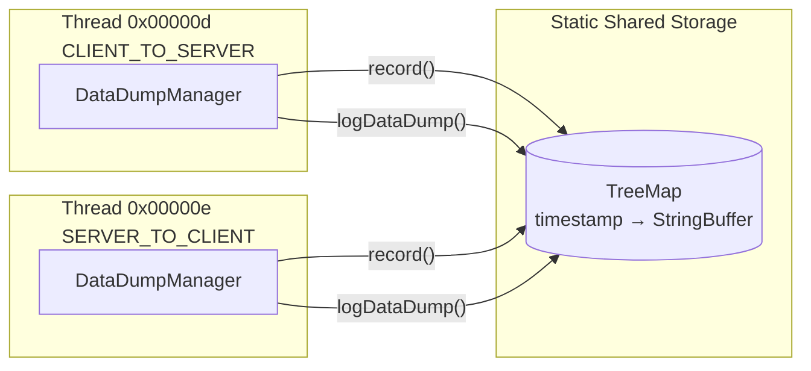

### Synchronized Access

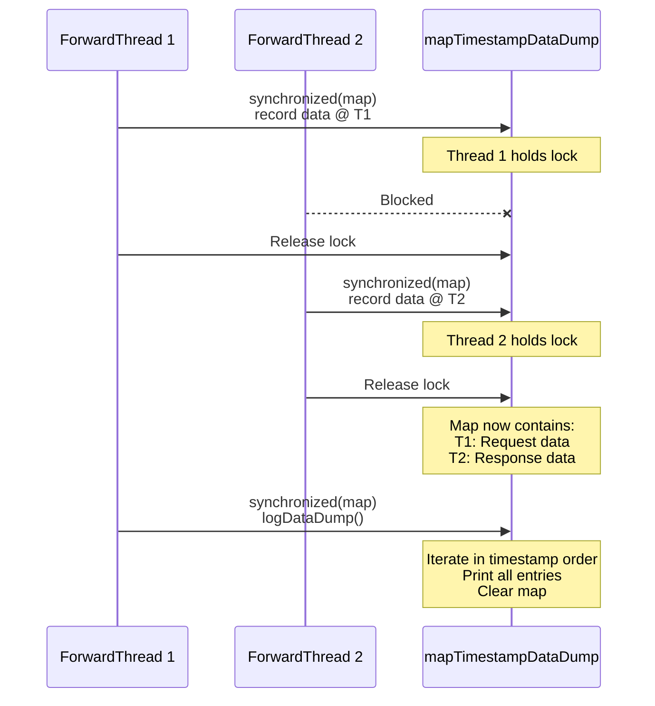

### Output Format

```
Thread 00000d: 2026-06-03 18:20:30.409: 127.0.0.1:54247 -> 127.0.0.1:3000
  Offset 00 01 02 03 04 05 06 07 08 09 0A 0B 0C 0D 0E 0F 0123456789ABCDEF
  -----------------------------------------------------------------------
  000000 47 45 54 20 2F 20 48 54 54 50 2F 31 2E 31 0D 0A GET / HTTP/1.1  
```

---

## Configuration

### Environment Variables

| Variable | Description | Default |
|----------|-------------|---------|
| `MODE` | Protocol: `TCP` or `UDP` | `TCP` |
| `DUMP` | Enable traffic logging (any value) | disabled |
| `DUMP_WIDTH` | Bytes per row in hex dump (multiple of 16) | 16 |
| `DUMP_HTTP` | HTTP-specific logging (future) | disabled |

### Command Line

```bash
java JavaForwarder <remoteHost> <remotePort> <localPort>
```

**Example:**
```bash
# Forward traffic from localhost:80 to localhost:3000
# Set DUMP environment variable to enable logging
export DUMP=1
java JavaForwarder localhost 3000 80
```

---

## HTTP Keep-Alive Scenario

The following diagram shows a complete HTTP Keep-Alive scenario with two requests:

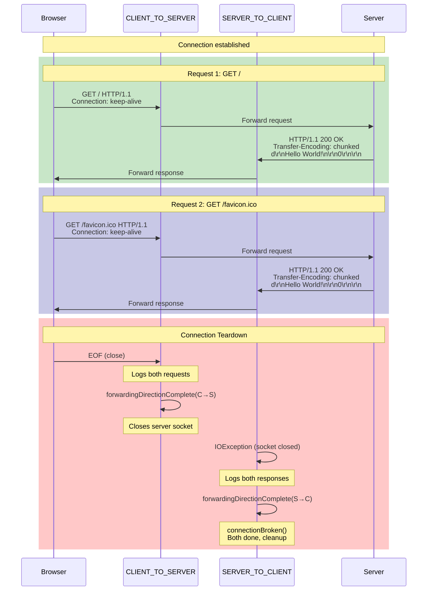

---

## Typical Log Output

```
JavaForwarder v1.13 (C) by Roman.Stangl@gmx.net
JavaForwarder starting proxy thread, forwarding TCP connection: localhost:3000 on local port 80
JavaForwarder proxy thread waiting for client connection(s) ...
JavaForwarder waiting for client connection(s), press Enter to terminate JavaForwarder ...
JavaForwarder accepted client thread ...
JavaForwarder connecting to server ...
JavaForwarder connected to server
JavaForwarder TCP connection: 127.0.0.1:54247 <--> 127.0.0.1:3000 started

Thread 00000d: 2026-06-03 18:20:30.409: 127.0.0.1:54247 -> 127.0.0.1:3000
  [Request 1: GET / HTTP/1.1 ...]

Thread 00000e: 2026-06-03 18:20:30.443: 127.0.0.1:3000 -> 127.0.0.1:54247
  [Response 1: HTTP/1.1 200 OK ...]

Thread 00000d: 2026-06-03 18:20:30.489: 127.0.0.1:54247 -> 127.0.0.1:3000
  [Request 2: GET /favicon.ico HTTP/1.1 ...]

Thread 00000e: 2026-06-03 18:20:30.493: 127.0.0.1:3000 -> 127.0.0.1:54247
  [Response 2: HTTP/1.1 200 OK ...]

JavaForwarder: CLIENT_TO_SERVER forwarding completed
JavaForwarder: Closed server socket to unblock SERVER_TO_CLIENT
JavaForwarder: SERVER_TO_CLIENT forwarding completed
JavaForwarder: Both directions closed, terminating connection
JavaForwarder TCP connection: 127.0.0.1:54247 <--> 127.0.0.1:3000 stopped
```

---

## Future Enhancements

1. **HTTP-Aware Logging** (`DUMP_HTTP` environment variable)
   - Parse HTTP headers and body separately
   - Display in Postman/Bruno-like format
   - Handle chunked transfer encoding display

2. **UDP Support**
   - Currently partially implemented
   - Needs bidirectional forwarding completion

3. **Connection Pooling**
   - Reuse server connections for multiple client connections
   - Reduce connection overhead

4. **TLS/SSL Support**
   - Intercept HTTPS traffic (with proper certificates)
   - Display decrypted content

---

## License

This program is freeware based on an example from the book "Internet programming with Java" by Svetlin Nakov.

For more information: http://www.nakov.com/books/inetjava/
